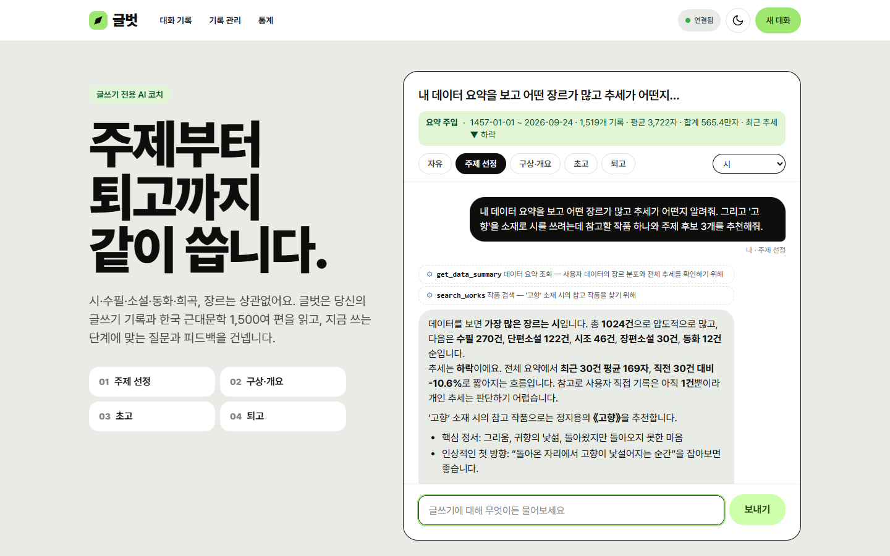
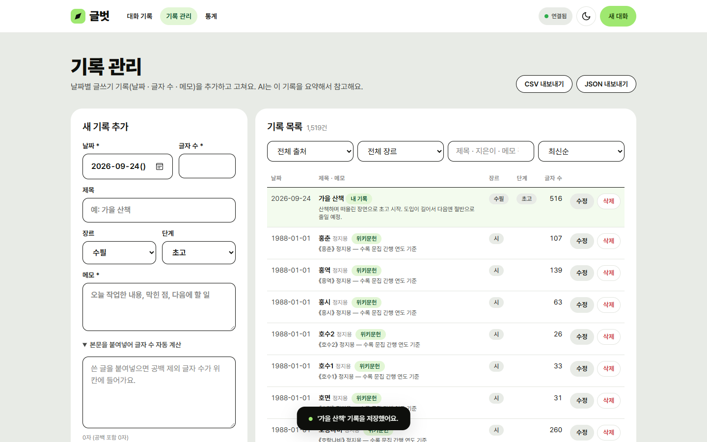
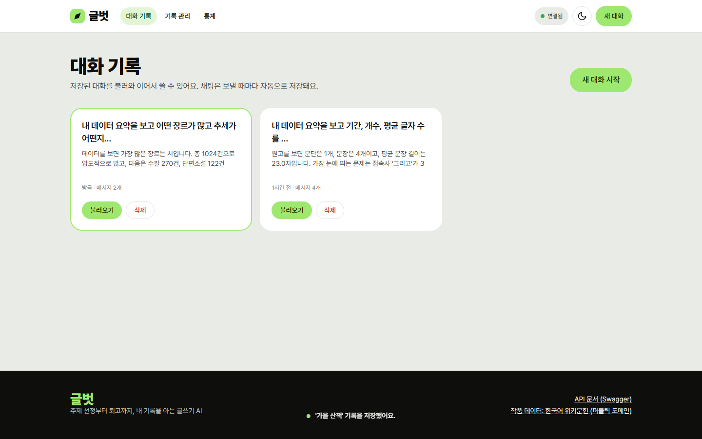
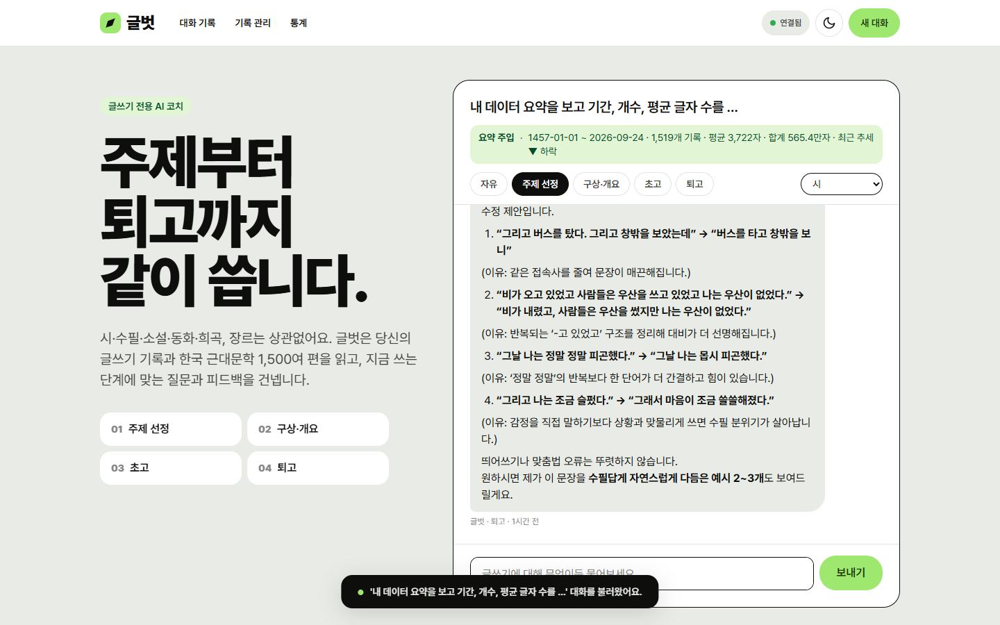
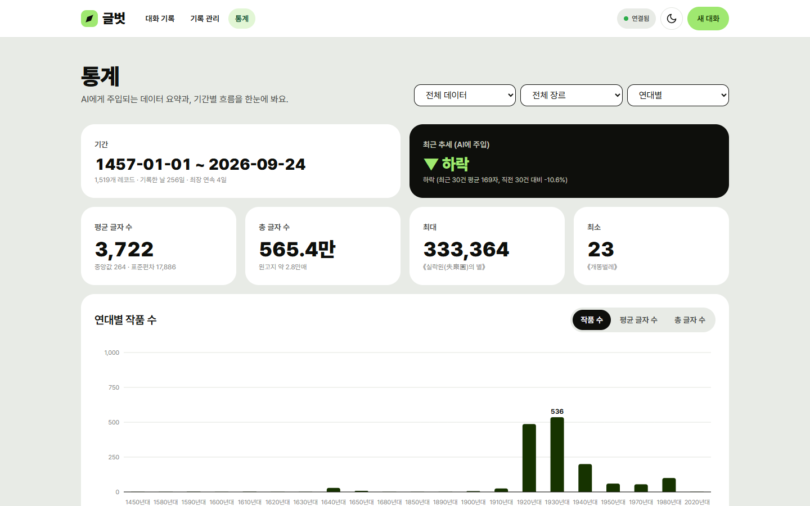
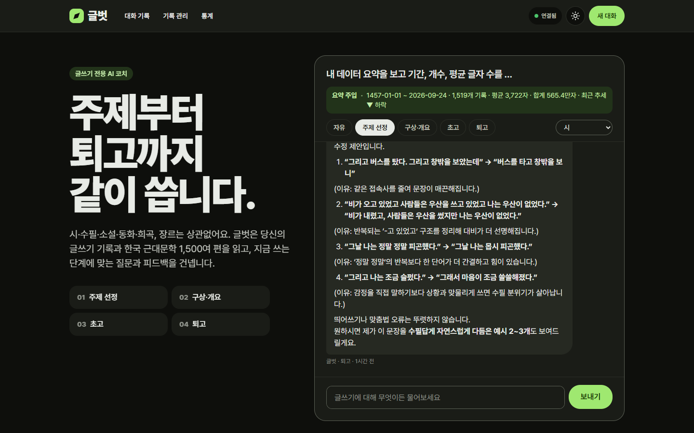
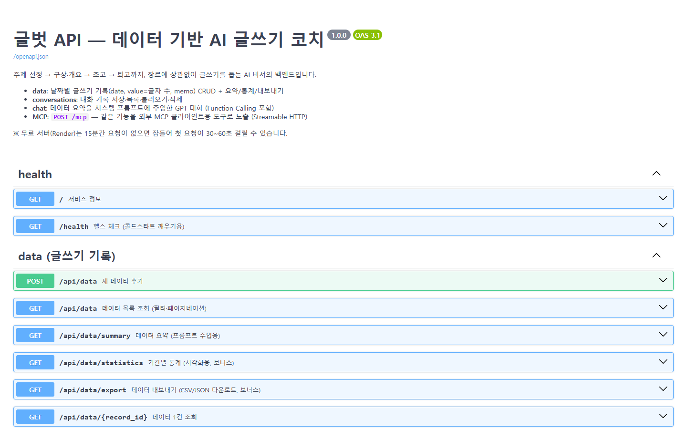

# 글벗 — 내 기록을 아는 AI 글쓰기 코치

> 주제 선정 → 구상·개요 → 초고 → 퇴고까지, 시·수필·소설·동화·희곡 등 **장르에 상관없이** 글쓰기 전 과정을 돕는 AI 비서

| 구분 | URL |
|---|---|
| 프론트엔드 (Vercel) | https://geulbeot-psi.vercel.app |
| 백엔드 API (Render) | https://geulbeot-api.onrender.com |
| Swagger UI | https://geulbeot-api.onrender.com/docs |
| GitHub | https://github.com/PSHUN03/Codyssey-M1-2 |

※ 백엔드는 Render 무료 플랜이라 15분간 요청이 없으면 잠듭니다. 첫 접속 때 30~60초 걸릴 수 있으며, 프론트엔드는 접속 즉시 `/health`로 서버를 깨우고 늦어지면 안내 배너를 띄웁니다.

---

## 1. 무엇을 해결하나요?

일반 챗봇에게 "요즘 내 글쓰기 어때?", "이번 주엔 뭘 써볼까?"라고 물으면 누구에게나 할 법한 답만 돌아옵니다.
글벗은 **날짜별 글쓰기 기록(시계열 데이터)**을 분석한 요약을 시스템 프롬프트에 넣어서(**컨텍스트 주입**) 내 상황에 맞춰 답합니다.

- **주제 선정**: 내가 적게 써 본 장르나 소재를 짚어 주제 후보와 첫 문장 예시를 제안
- **구상·개요**: 장르별 뼈대(시: 이미지→정서 전환, 수필: 경험→사유, 소설: 인물·갈등·시점)와 **내 평균 분량 기준** 개요
- **초고**: 막힌 장면의 다음 선택지, 최근 기록을 근거로 한 오늘의 목표 분량
- **퇴고**: `analyze_text` 도구로 글자 수·문장 길이·반복어·반복 어미를 **실제로 측정한 뒤** `원문 → 수정안 (이유)` 형식으로 피드백
- **참고 작품**: 위키문헌에서 모은 한국 근대문학(퍼블릭 도메인) 1,518편 중 필요한 예문을 찾아 인용

## 2. 데이터: 시계열 글쓰기 기록

| 필드 | 의미 | 예 |
|---|---|---|
| `date` | 작성(발표)일 | `2026-09-20` |
| `value` | 글자 수 (공백 제외) | `1240` |
| `memo` | 작업 메모 | `도입을 절반으로 줄임` |
| `genre`, `title`, `author`, `stage`, `source`, `excerpt`, `url` | 글쓰기 도메인 부가 정보 | `수필`, `가을 산책`, `초고` … |

데이터는 두 출처가 한 컬렉션에 섞여 있습니다.

1. **위키문헌 작품 1,518편** — [한국어 위키문헌](https://ko.wikisource.org) MediaWiki API로 수집 ([`backend/scripts/import_wikisource.py`](backend/scripts/import_wikisource.py))
   - 분류(시·시조·수필·단편/중편/장편소설·동화·희곡)와 시집·수필집 하위 작품을 순회
   - **날짜**: 본문 끝의 창작일(예: `1941. 11. 20.`) → 설명란의 발표 연·월·일 → `NNNN년 작품` 분류 순으로 추출. 개별 날짜가 없는 시집 수록작만 시집 간행일을 쓰고 메모에 `수록 문집 간행 연도 기준`이라고 밝힘. 날짜를 전혀 알 수 없는 작품은 제외
   - 요청 제한(HTTP 429)을 지키려고 요청 간격 1.2초 + `Retry-After` 재시도, 응답은 로컬 캐시(git 제외)
   - **글자 수**: 위키 문법·틀·각주를 걷어낸 본문(원문/현대 표기 병기 시 현대 표기)의 공백 제외 글자 수
   - 기간 1457 ~ 1988년 (1920~40년대가 1,223편)
   - 장르 분포: 시 1,024 · 수필 269 · 단편소설 122 · 시조 46 · 장편소설 30 · 동화 12 · 중편소설 8 · 희곡 7
2. **내가 쓴 기록** — 웹 화면의 '기록 관리' 탭이나 `POST /api/data`로 추가 (`source = "직접 작성"`)

자세한 분석 결과(연대별·장르별 통계, 날짜 정밀도, 작가 순위)는 [`docs/data-analysis.md`](docs/data-analysis.md) — `python -m scripts.analyze_data`가 서비스와 같은 요약 함수로 생성합니다.

### 요약 정보 (`GET /api/data/summary`)

- 기간·개수, 글자 수 합계/평균/중앙값/최대/최소/표준편차, 가장 긴 글·짧은 글
- **최근 추세**: 날짜순으로 정렬한 뒤 최근 N건(N = 전체의 1/5, 5~30건) 평균과 직전 N건 평균을 비교해 ±5% 이상이면 상승/하락, 아니면 유지
- 장르별·출처별·단계별 분포, 최근 기록 5건
- `?mine=true`, `?genre=시`처럼 범위를 좁혀서도 요약 가능

## 3. 기술 스택

| 영역 | 사용 기술 |
|---|---|
| 백엔드 | Python 3.12, FastAPI, Pydantic v2, Uvicorn |
| DB | Firebase Firestore (`firebase-admin`) — 컬렉션 `data`, `conversations` |
| AI | OpenAI Chat Completions API + Function Calling — 모델 `gpt-5.4-mini` (Codyssey OpenAI 호환 게이트웨이 `OPENAI_BASE_URL` 경유, 개인 OpenAI 키면 주소만 비우면 됨) |
| 테스트 | pytest 11개 (메모리 저장소 + 가짜 GPT 클라이언트) |
| 프론트엔드 | HTML / CSS / JavaScript (프레임워크·차트 라이브러리 없이 SVG 직접 렌더링) |
| 배포 | Render (백엔드), Vercel (프론트엔드) |
| 보너스 | MCP 서버 (`mcp` Python SDK v2, stdio) |

## 4. 프로젝트 구조

```
writing-assistant/
├─ backend/
│  ├─ main.py                  # FastAPI 앱, CORS, 예외 처리, 라우터 등록
│  ├─ mcp_server.py            # (보너스) MCP 서버 — REST API를 도구로 노출
│  ├─ app/
│  │  ├─ config.py             # 환경 변수 로딩
│  │  ├─ firebase.py           # Firestore 초기화 (키는 환경 변수로만)
│  │  ├─ storage.py            # 저장소 추상화 (Firestore / 로컬 확인용 메모리)
│  │  ├─ schemas.py            # Pydantic 요청·응답 모델 (검증 규칙)
│  │  ├─ prompts.py            # 시스템 프롬프트 템플릿 + 단계별 코칭 가이드
│  │  ├─ seed.py               # 수집 데이터 → data 컬렉션 적재
│  │  ├─ rate_limit.py         # /api/chat 요청 횟수 제한
│  │  ├─ routers/              # HTTP 계층: data, conversations, chat
│  │  └─ services/             # 비즈니스 로직: data, summary, conversation, chat, tools
│  ├─ scripts/
│  │  ├─ import_wikisource.py  # 위키문헌 API 수집 → data/wikisource_works.json
│  │  ├─ seed_firestore.py     # JSON → Firestore 적재
│  │  └─ analyze_data.py       # 분석 리포트 → docs/data-analysis.md
│  ├─ tests/                   # pytest
│  └─ data/wikisource_works.json
├─ frontend/
│  ├─ build.js                 # Vercel 빌드: API_BASE_URL → public/config.js
│  ├─ vercel.json
│  └─ public/ (index.html, styles.css, config.js, js/*.js)
├─ docs/ (data-analysis.md, screenshots/)
└─ render.yaml                 # Render Blueprint
```

**분리 기준**: `routers`는 HTTP(경로·상태 코드·쿼리 파라미터)만, `services`는 순수 로직만 담당합니다. 그래서 `/api/chat`의 요약 조회와 GPT 도구 실행이 `GET /api/data/summary`와 **같은 서비스 함수**를 재사용하고, 저장소는 `storage.py` 인터페이스 뒤에 숨겨서 Firestore API가 서비스 밖으로 새지 않습니다.

## 5. API

| Method | Path | 설명 |
|---|---|---|
| POST | `/api/data` | 새 기록 추가 |
| GET | `/api/data` | 목록 (필터: `genre`, `source`, `stage`, `q`, `start`, `end`, `mine` / `order`, `limit`, `offset`) |
| GET | `/api/data/{id}` | 1건 조회 |
| PUT | `/api/data/{id}` | 수정 (보낸 필드만 변경) |
| DELETE | `/api/data/{id}` | 삭제 |
| GET | `/api/data/summary` | 요약 (프롬프트 주입용) |
| GET | `/api/data/statistics` | (보너스) 연대/연도/월별 시계열, 다작 작가, 기록 일수, 최장 연속 기록 |
| GET | `/api/data/export?format=csv\|json` | (보너스) 내보내기 다운로드 |
| POST | `/api/conversations` | 대화 저장 |
| GET | `/api/conversations` | 대화 목록 — **messages 미포함**(`message_count`, `preview`만) |
| GET | `/api/conversations/{id}` | 특정 대화 전체 messages 불러오기 (요구사항 A 방식) |
| DELETE | `/api/conversations/{id}` | 대화 삭제 |
| POST | `/api/chat` | AI 대화 (요약 주입 + 도구 호출 + 자동 저장) |
| GET | `/health` | 헬스 체크 / 콜드스타트 깨우기 |

### 입력 검증 (Pydantic)

- `date`: 실제 날짜 형식만 허용, **미래 날짜 거부**
- `value`: 0 이상 2,000,000 이하 정수
- `memo`: 1~500자, 공백만 입력 불가
- `genre`·`stage`: 정해진 값(Literal)만 허용 → 통계가 오타로 쪼개지지 않음
- `PUT`: 필드를 하나도 보내지 않으면 422
- 채팅 `message` 1~8,000자, 대화 messages 1~200개
- 422 응답은 `"입력값을 확인해 주세요 — date: 미래 날짜는 기록할 수 없습니다."`처럼 화면에 그대로 보여줄 수 있는 한국어 문장으로 변환

**이유**: 잘못된 값이 DB에 한 번 들어가면 요약 통계와 AI 답변이 함께 틀어집니다. 요청 단계에서 막으면 라우터·서비스 코드는 "값이 올바르다"고 믿고 단순하게 짤 수 있고, 같은 규칙이 Swagger 문서에도 자동으로 나타납니다. 위키문헌 적재 스크립트도 같은 `DataCreate` 모델을 통과시킵니다.

## 6. Firestore 설계와 CRUD

```
(Firestore, asia-northeast3)
├─ data/{자동 ID}                         ← 시계열 기록 1건 = 문서 1개
│    date: "1941-11-20"   value: 64   memo: "《서시》 윤동주 — 창작일 기준"
│    genre: "시"  title  author  stage  source: "위키문헌" | "직접 작성"
│    excerpt(본문 앞 300자)  url  pageid(중복 방지)  created_at  updated_at
└─ conversations/{자동 ID}                ← 대화 1개 = 문서 1개
     title: "가을 수필 주제 찾기"   created_at   updated_at
     messages: [ {role, content, stage, created_at, tool_calls:[{name, arguments, reason}]}, … ]
```

- **왜 이렇게 나눴나**: 기록은 목록·필터·통계의 단위라 1건 = 1문서. 대화는 항상 통째로 불러오므로 메시지를 배열로 한 문서에 담아 읽기 1회로 끝냅니다 (최대 200개로 잘라 1MB 문서 한도를 지킴).
- **날짜는 `YYYY-MM-DD` 문자열**: 문자열 정렬이 곧 시간순이라 추세 계산과 기간 필터가 단순해집니다.
- **CRUD 구현** ([`app/storage.py`](backend/app/storage.py)):

| 동작 | Firestore 호출 |
|---|---|
| Create | `collection("data").add(doc)` — 자동 ID, `created_at/updated_at` 서버에서 기록 |
| Read (목록) | `collection("data").stream()` → 서버 메모리에 1시간 캐시, 필터·정렬·페이지는 캐시에서 처리 |
| Read (1건) | `document(id).get()` |
| Update | `document(id).update(바뀐 필드)` — 없는 ID는 404 |
| Delete | `document(id).delete()` — 없는 ID는 404 |
| 대량 적재 | `db.batch()` 400건씩 `commit()` (시드 스크립트) |

- 이 서버를 거친 쓰기는 **바뀐 문서만 캐시에 반영**해서 다음 요약·채팅이 곧바로 최신 데이터를 보면서도, 기록 1건 저장에 1,518건을 다시 읽지 않습니다 (Firestore 무료 한도: 하루 읽기 5만 회). 캐시는 1시간마다 새로 읽습니다.
- 서비스 계정 키는 `FIREBASE_SERVICE_ACCOUNT_JSON`(배포) 또는 `FIREBASE_CREDENTIALS_PATH`(로컬)로만 받고, Firestore 보안 규칙은 **프로덕션 모드(클라이언트 직접 접근 차단)** 입니다. 브라우저는 반드시 백엔드 API를 거칩니다.

## 7. 컨텍스트 주입과 AI 호출 흐름

```
사용자 메시지 (+ 단계: 주제 선정/구상·개요/초고/퇴고, 장르)
   │
   ▼
POST /api/chat
   ├─ ① summary_service.get_summary()          ← GET /api/data/summary 와 같은 함수
   │     + get_summary(mine=True)              ← '내가 쓴 기록'만의 요약
   ├─ ② prompts.build_system_prompt()          ← 요약 수치 + 단계별 코칭 가이드를 시스템 프롬프트에 삽입
   ├─ ③ GPT 호출 (tools=7개, max_completion_tokens 제한, 요청 횟수 제한 통과 후)
   │     └─ tool_calls 가 오면 서버가 도구 실행 → 결과를 role=tool 로 돌려주고 재호출 (최대 3회)
   └─ ④ conversation_service: 사용자 질문 + AI 답변(+ 호출한 도구 기록)을 conversations 에 자동 저장
   │
   ▼
{ conversation_id, reply, tool_calls[{name, arguments, reason}], summary_used, usage }
```

시스템 프롬프트 (요약 부분):

```
[사용자 데이터 요약]
- 데이터 기간: {period}
- 총 레코드: {count}개
- 주요 지표: 합계 {total}자 / 평균 {average}자 / 중앙값 {median}자 / 최대 {max}자 / 최소 {min}자
- 최근 트렌드: {trend}
- 장르 분포: …
[사용자가 직접 쓴 기록]
- 기간 / 건수 / 평균, 최근 트렌드, 작업 단계 분포, 최근 기록
[현재 작업 단계: 퇴고]
- 구조 → 문단 → 문장 → 단어 순서로 점검 …
```

**원리**: GPT는 우리 DB를 모르므로 매 요청마다 "지금 이 사용자의 데이터는 이렇다"는 사실을 시스템 메시지로 넣어 줍니다. 전체 레코드(1,518+건)를 넣으면 토큰이 크게 늘어나므로 **요약만** 넣고, 더 자세한 정보(특정 작품 본문, 기간별 통계, 이전 대화)는 모델이 필요할 때 도구로 가져오게 했습니다.

## 8. (보너스) Function Calling — 어떤 근거로 어떤 도구를 부르나

모든 도구에 필수 인자 `reason`(호출 이유)을 두어 **모델이 스스로 적은 근거**를 응답의 `tool_calls`와 대화 기록에 남기고, 채팅 화면에 칩(⚙)으로 보여줍니다.

| 도구 | 언제 호출하나 (description에 명시한 근거) | 내부 동작 |
|---|---|---|
| `get_data_summary` | 특정 장르·기간·'내 기록만'의 요약이 필요할 때 | `summary_service.get_summary(**filters)` |
| `get_statistics` | 연도/월/연대별 흐름, 다작 작가, 연속 기록을 물을 때 | `summary_service.get_statistics()` |
| `search_works` | 예문·참고 작품·특정 작가의 글·내가 예전에 쓴 글을 찾을 때 | `data_service.filter_records(q=…)` + 본문 발췌 |
| `list_my_records` | 최근 작업 내역, 단계별 진행 상황이 필요할 때 | `data_service.list_records(mine=True)` |
| `list_conversations` / `get_conversation` | "지난번에 얘기한 것"을 언급할 때 | `conversation_service` |
| `analyze_text` | 퇴고 요청 시 (시스템 프롬프트 원칙 4번) | 글자 수·원고지 매수·문장 길이·반복어·반복 어미·접속사 측정 |

예) "'고향'을 소재로 한 시를 쓰고 싶어. 참고할 만한 작품도 찾아줘."

```
1. 모델 → search_works {keyword:"고향", genre:"시", reason:"고향을 다룬 시 예문을 찾기 위해"}
2. 서버 → 위키문헌 데이터에서 검색, 발췌 포함 결과 반환
3. 모델 → 결과를 근거로 《제목》·지은이를 밝혀 인용하며 주제 후보 제시
4. 서버 → 답변 + tool_calls 를 conversations 에 저장
```

**배포 서버에 실제로 저장된 호출 기록** (`GET /api/conversations/{id}`의 `messages[].tool_calls`, `reason`은 모델이 직접 쓴 문장):

| 사용자 질문 (단계) | 호출한 도구와 인자 | 모델이 밝힌 근거 (`reason`) |
|---|---|---|
| "내 데이터 요약을 보고 기간, 개수, 평균 글자 수를 알려줘." (자유) | `get_data_summary {}` | 사용자의 전체 글 기록 요약에서 기간, 개수, 평균 글자 수를 확인하기 위해 |
| "…어떤 장르가 많고 추세가 어떤지 알려줘. 그리고 '고향'을 소재로 시를 쓰려는데 참고할 작품 하나와 주제 후보 3개를 추천해줘." (주제 선정, 장르: 시) | ① `get_data_summary {"mine": false}`<br>② `search_works {"keyword": "고향", "genre": "시", "limit": 1}` | ① 사용자 데이터의 장르 분포와 전체 추세를 확인하기 위해<br>② '고향' 소재 시의 참고 작품을 찾기 위해 |
| "아래 글을 퇴고해줘. (원고)" (퇴고) | `analyze_text {"text": "그날 나는 정말 정말 피곤했다. …"}` | 사용자 원고의 문장 길이, 반복어, 접속사 사용을 분석해 퇴고 근거를 마련합니다. |

세 번째 경우, 모델은 측정 결과(문장 4개, 평균 23.0자, 접속사 '그리고' 3회)를 근거로 `원문 → 수정안 (이유)` 형식의 제안 4개를 돌려줬습니다 (스크린샷 `history.png`).

## 9. (보너스) MCP 서버 — 멀티채널 연동

[`backend/mcp_server.py`](backend/mcp_server.py)는 같은 기능을 **MCP 도구**로 노출합니다. DB에 직접 붙지 않고 **배포된 REST API를 호출**하므로 외부 클라이언트도 웹과 똑같은 검증·저장 규칙을 거칩니다.

```
Claude Desktop / Claude Code (MCP 클라이언트)
   │ stdio (JSON-RPC)
   ▼
mcp_server.py ──HTTP──▶ Render 백엔드 (/api/data/summary, /api/data, /api/conversations …) ──▶ Firestore
```

도구: `get_data_summary`, `get_statistics`, `search_works`, `list_my_records`, `list_conversations`, `get_conversation`, `add_writing_record`

Claude Code에 등록:

```bash
claude mcp add geulbeot -e GEULBEOT_API_URL=https://geulbeot-api.onrender.com -- python backend/mcp_server.py
```

Claude Desktop (`claude_desktop_config.json`):

```json
{
  "mcpServers": {
    "geulbeot": {
      "command": "C:/…/writing-assistant/backend/.venv/Scripts/python.exe",
      "args": ["C:/…/writing-assistant/backend/mcp_server.py"],
      "env": { "GEULBEOT_API_URL": "https://geulbeot-api.onrender.com" }
    }
  }
}
```

**검증 결과** — [`scripts/mcp_smoke_test.py`](backend/scripts/mcp_smoke_test.py)가 `mcp_server.py`를 stdio로 띄우고 MCP 클라이언트(`ClientSession`)로 **배포된 Render API**를 대상으로 도구를 호출합니다.

```bash
cd backend
python -m scripts.mcp_smoke_test https://geulbeot-api.onrender.com
```

```text
서버: geulbeot · 연결 대상 API: https://geulbeot-api.onrender.com
도구: get_data_summary, get_statistics, search_works, list_my_records, list_conversations, get_conversation, add_writing_record
- get_data_summary({}) → 성공: {   "period": "1457-01-01 ~ 2026-09-24",   "period_start": "1457-01-01",   "period_end": "2026-09-24",   "count": 1519,   "metrics": {     "total": 5654023,     "average": 3722.2,     "median": 264.0,     "max": 333364, 
- get_statistics({"group": "decade", "genre": "시"}) → 성공: {   "group": "decade",   "filters": {     "genre": "시"   },   "series": [     {       "period": "1890년대",       "count": 1,       "total": 165,       "average": 165.0     },     {       "period": "1900년대",       "count":
- search_works({"keyword": "고향", "genre": "시", "limit": 2}) → 성공: {   "date": "1988-01-01",   "title": "고향",   "author": "정지용",   "genre": "시",   "value": 132,   "memo": "《고향》 정지용 — 수록 문집 간행 연도 기준",   "excerpt": "고향에 고향에 돌아와도\n그리던 고향은 아니러뇨.\n\n산꽁이 알을 품고\n뻐꾹이 제철에 울건만,\n\n마음은 제고향 진히지 않고\
- list_conversations({"limit": 3}) → 성공: {   "id": "nAodYCxlCTO3NIk0nt9v",   "title": "내 데이터 요약을 보고 어떤 장르가 많고 추세가 어떤지…",   "message_count": 2,   "preview": "데이터를 보면 **가장 많은 장르는 시**입니다. 총 **1024건**으로 압도적으로 많고, 다음은 **수필 270건**, **단편소설 122건",   "created_at": "2026
```

→ 웹 채팅(Function Calling)과 MCP(외부 클라이언트) 두 채널이 **같은 REST API와 같은 Firestore 데이터**를 쓰는 것을 확인했습니다.

## 10. 화면 구성과 디자인

| 경로 | 화면 | 내용 |
|---|---|---|
| `#/` | 홈 | "글쓰기를 위한 AI" 소개 + 채팅 카드만. 채팅 카드 안에 주입된 요약 한 줄, 단계 칩, 장르 선택 |
| `#/history` | 대화 기록 | 저장된 대화 카드 목록 → 불러오기(홈 채팅으로 복원) / 삭제 |
| `#/records` | 기록 관리 | 기록 추가·수정·삭제 폼, 필터·검색·페이지 목록, CSV/JSON 내보내기 |
| `#/insights` | 통계 | 요약 타일, 기간별 막대그래프, 장르·작가 분포 |

- 해시 라우팅으로 한 페이지 안에서 화면 전환 (바닐라 JS, 프레임워크 없음)
- 디자인 토큰: 라임 그린 CTA(`#9fe870`) 하나만 강조색으로 사용, 세이지 캔버스(`#e8ebe6`) 위 흰 카드, 올리브 톤 잉크(`#0e0f0c`), 버튼·카드 반경 24px, 입력창 1px 잉크 테두리
- 타이포: 헤드라인 900 / 나머지 600·400. 한글 지원을 위해 Inter 기반 한글 폰트 **Pretendard**를 사용
- 다크 모드: 극성 반전 (잉크 바탕 + 세이지 글자), CTA는 그대로 라임 그린
- 반응형: 1024px 미만은 소개 → 채팅 세로 배치, 768px 미만은 1열 + 단계 칩 가로 스크롤

## 11. (보너스) 인사이트·UX

- **추가 지표**: 중앙값, 표준편차, 가장 긴/짧은 글, 단계별 분포, `/api/data/statistics`의 기간별 시계열·다작 작가·기록 일수·최장 연속 기록
- **시각화**: '통계' 탭의 기간별 막대그래프 (연대/연도/월 × 작품 수/평균 글자 수/총 글자 수, 마우스 오버 툴팁, 표로 보기)
- **내보내기**: 기록 관리 탭에서 현재 필터 기준 CSV(엑셀 한글 호환 BOM) / JSON 다운로드
- **다크 모드**: 우측 상단 토글 (OS 설정을 따르다가, 직접 고르면 브라우저에 기억)
- **선택 UI**: 채팅의 글쓰기 단계 칩(자유/주제 선정/구상·개요/초고/퇴고) + 장르 선택 → 시스템 프롬프트의 코칭 가이드가 바뀜

## 12. 로컬 실행 방법

### 백엔드

```bash
cd backend
python -m venv .venv
.venv\Scripts\activate            # macOS/Linux: source .venv/bin/activate
pip install -r requirements.txt
copy .env.example .env            # macOS/Linux: cp .env.example .env  → 값 채우기
python -m scripts.seed_firestore  # 위키문헌 작품을 Firestore에 적재 (최초 1회)
uvicorn main:app --reload         # http://localhost:8000/docs
```

- 위키문헌 데이터를 새로 수집하려면 `python scripts/import_wikisource.py` (요청 제한 때문에 10분 이상 걸림)
- Firebase 키 없이 화면만 확인하려면 `.env`에 `STORAGE_BACKEND=memory` (서버를 재시작하면 데이터가 초기화됨)

### 프론트엔드

```bash
cd frontend/public
python -m http.server 5500        # http://localhost:5500
```

### 테스트

```bash
cd backend
pip install -r requirements-dev.txt
pytest -q                          # 11 passed — Firebase·OpenAI 키 없이 실행됨
```

`public/config.js`의 기본 API 주소는 `http://localhost:8000`입니다.

## 13. 환경 변수

### 백엔드 (Render / `backend/.env`)

| 이름 | 필수 | 설명 |
|---|---|---|
| `OPENAI_API_KEY` | ✅ | OpenAI API 키 |
| `FIREBASE_SERVICE_ACCOUNT_JSON` | ✅(배포) | 서비스 계정 키 JSON **전체 문자열** |
| `FIREBASE_CREDENTIALS_PATH` | ✅(로컬) | 또는 키 파일 경로 (`./firebase-key.json`, git 제외) |
| `ALLOWED_ORIGINS` | ✅ | CORS 허용 도메인, 쉼표 구분 (예: `https://geulbeot.vercel.app`) |
| `OPENAI_BASE_URL` | | OpenAI 호환 게이트웨이 주소 (Codyssey: `https://copa.codyssey.kr/v1`). 비우면 OpenAI 공식 API |
| `OPENAI_MODEL` | | 기본 `gpt-5.4-mini` |
| `OPENAI_MAX_TOKENS` | | 답변 1회 최대 토큰, 기본 1200 (과금 방지) |
| `CHAT_RATE_PER_MINUTE` | | IP별 분당 채팅 요청 수, 기본 6 (초과 시 429) |
| `CHAT_DAILY_LIMIT` | | 서버 전체 하루 채팅 요청 수, 기본 300 |
| `MAX_TOOL_ROUNDS` | | 채팅 1회당 도구 호출 반복 상한, 기본 3 |
| `CHAT_HISTORY_LIMIT` | | GPT에 함께 보내는 이전 메시지 수, 기본 10 |
| `STORAGE_BACKEND` | | `firestore`(기본) / `memory`(로컬 확인용) |

### 프론트엔드 (Vercel)

| 이름 | 필수 | 설명 |
|---|---|---|
| `API_BASE_URL` | ✅ | 백엔드 주소 (예: `https://geulbeot-api.onrender.com`). 빌드 때 `build.js`가 `config.js`로 만들어 넣음 |

## 14. 배포

### 백엔드 — Render (`geulbeot-api`, 싱가포르 리전, Free)

1. GitHub 저장소 연결 → **New Web Service** (또는 [`render.yaml`](render.yaml) Blueprint)
2. Build `cd backend && pip install -r requirements.txt` / Start `cd backend && uvicorn main:app --host 0.0.0.0 --port $PORT` (Blueprint 사용 시 `rootDir: backend`)
3. 환경 변수
   - 일반 값: `PYTHON_VERSION=3.12.8`, `OPENAI_BASE_URL`, `OPENAI_MODEL`, `OPENAI_MAX_TOKENS`, `STORAGE_BACKEND=firestore`, `ALLOWED_ORIGINS`
   - **비밀 값은 대시보드에서만 입력**: `OPENAI_API_KEY`, `FIREBASE_SERVICE_ACCOUNT_JSON`(키 JSON을 한 줄로)
4. `main` 브랜치에 푸시하면 자동 재배포 → `https://geulbeot-api.onrender.com/docs` 확인

### 프론트엔드 — Vercel (`geulbeot`)

1. 같은 저장소 Import (Vercel GitHub 앱 설치 필요) → Root Directory `frontend`, Build `node build.js`, Output `public` ([`vercel.json`](frontend/vercel.json))
2. 환경 변수 `API_BASE_URL=https://geulbeot-api.onrender.com` → 빌드 때 `build.js`가 `public/config.js`로 만들어 넣음 (값이 없으면 빌드를 실패시켜 잘못된 배포를 막음)
3. 공개 주소는 프로덕션 도메인 **https://geulbeot-psi.vercel.app** (배포별 주소는 Vercel 배포 보호로 비공개 유지)
4. 이 주소를 Render의 `ALLOWED_ORIGINS`에 추가 → 다른 출처는 CORS 헤더를 받지 못함 (직접 확인: 허용 출처만 `access-control-allow-origin` 응답)

### 왜 CORS·환경 변수·키 관리가 필요한가

- **CORS**: 프론트(`*.vercel.app`)와 백엔드(`*.onrender.com`)는 출처가 다르므로, 브라우저는 백엔드가 허용한 출처의 요청만 응답을 읽게 합니다. `ALLOWED_ORIGINS`에 우리 프론트만 넣어 다른 사이트가 사용자의 브라우저를 통해 API를 쓰지 못하게 합니다.
- **환경 변수**: 로컬·배포 환경마다 다른 값(API 주소, 허용 도메인)을 코드 수정 없이 바꿀 수 있고, 비밀 값을 코드에서 분리합니다.
- **키 관리**: OpenAI 키가 노출되면 타인이 내 비용으로 API를 쓰고, Firebase 서비스 계정 키는 DB 전체 관리자 권한입니다. 그래서 키는 `.env`(git 제외)와 Render 환경 변수에만 두고, 프론트엔드에는 절대 넣지 않습니다(브라우저 코드는 누구나 볼 수 있음). 모든 OpenAI 호출은 백엔드에서만 일어납니다.

### 비용 관리

- **요청 횟수 제한**: `/api/chat`은 IP별 분당 6회, 서버 전체 하루 300회를 넘으면 `429`와 안내 문구를 돌려줌 ([`app/rate_limit.py`](backend/app/rate_limit.py))
- **토큰 제한**: `max_completion_tokens`(기본 1200), 도구 반복 최대 3회, 이전 대화 10개까지만 전송
- **작은 데이터로 먼저 검증**: Firestore에 `seed_firestore --limit 20`으로 20건만 넣고 채팅 2회(요약 질문, 퇴고 요청)로 흐름을 확인한 뒤 `--reset`으로 1,518건 전체 적재
- 전체 데이터 대신 요약만 프롬프트에 넣음
- 요약·검색용 전체 레코드는 서버 메모리에 캐시하고 쓰기는 바뀐 문서만 반영해 Firestore 읽기 횟수 절약

## 15. 스크린샷

모두 **배포된 사이트**에서 [`docs/capture_screenshots.py`](docs/capture_screenshots.py)로 실제 흐름을 실행하며 찍었습니다.

**① 데이터 요약이 보이는 채팅 화면 (질문 + 답변)** — 채팅 카드 상단 '요약 주입' 줄이 시스템 프롬프트에 들어가는 요약(기간·개수·평균·합계·추세)이고, 답변 위 ⚙ 칩이 호출한 도구와 근거입니다.



**② 데이터 관리 화면 (추가 동작)** — 본문을 붙여넣어 글자 수 자동 계산 → 저장 → 목록 맨 위에 강조 표시 + 저장 알림



**③ 대화 기록 화면 (불러오기 동작)** — 대화 기록 목록에서 '불러오기'를 누르면 홈 채팅에 이전 대화(퇴고 대화)가 다시 표시됩니다.

| 대화 기록 목록 | 불러온 대화 |
|---|---|
|  |  |

**보너스·기타**

| 통계·시각화 | 다크 모드 | Swagger UI (배포 URL) |
|---|---|---|
|  |  |  |

## 16. 과제 목표별 설명

| # | 과제 목표 | 이 프로젝트에서의 답 | 근거 |
|---|---|---|---|
| 1 | 시계열 분석 → 요약 → 서비스 활용 | 위키문헌 1,518편 + 내 기록을 날짜순으로 정렬해 통계·추세를 계산하고, 그 요약을 채팅 프롬프트·요약 패널·통계 탭이 함께 씀 | §2, [`summary_service.py`](backend/app/services/summary_service.py), [`docs/data-analysis.md`](docs/data-analysis.md) |
| 2 | 라우터/서비스 분리 기준 | 라우터 = HTTP 규약(경로·쿼리·상태 코드), 서비스 = 비즈니스 로직, storage = DB. 채팅과 도구가 REST와 같은 서비스 함수를 재사용 | §4 |
| 3 | Pydantic 검증 이유와 방식 | 잘못된 값이 통계·AI 답변을 오염시키지 않도록 요청 단계에서 차단. `Field` 범위, `Literal` 장르/단계, 미래 날짜·공백 검사 validator, PUT 빈 요청 거부 | §5, [`schemas.py`](backend/app/schemas.py) |
| 4 | Firestore 저장과 CRUD | `data`(1건 = 1문서), `conversations`(대화 1개 = 1문서 + messages 배열), add/stream/get/update/delete/batch | §6 |
| 5 | 컨텍스트 주입 원리 | GPT는 DB를 모르므로 매 요청마다 요약을 시스템 메시지에 넣음. 전체 데이터 대신 요약만 넣어 토큰을 아끼고, 세부 정보는 도구로 필요할 때 조회 | §7 |
| 6 | CORS·환경 변수·키 관리 | 출처가 다른 프론트만 허용, 환경별 값 분리, 키는 서버 환경 변수에만 두고 브라우저에 노출하지 않음 | §14 |

## 요구사항 체크리스트

| 요구사항 | 구현 위치 / 확인 방법 |
|---|---|
| Python 3.10+ venv, fastapi·uvicorn·firebase-admin·openai·python-dotenv | [`requirements.txt`](backend/requirements.txt), Render는 Python 3.12.8 |
| 100개 이상 시계열 + 요약 정보 | 1,518건, `GET /api/data/summary` |
| CORS, `uvicorn main:app --reload`, `/docs` | [`main.py`](backend/main.py) |
| Firestore, 키 환경 변수 관리, `data`·`conversations` 컬렉션 | §6 |
| 데이터 API 5개 (CRUD 4 + summary) | §5 |
| 대화 API 저장·목록·삭제 + (A) 단건 조회 | §5 |
| `/api/chat`: 요약 조회 → 프롬프트 삽입 → GPT → 자동 저장 | §7, `tests/test_chat.py` |
| Render 배포, 배포 URL `/docs`, 콜드스타트 대응 | 맨 위 URL 표, `/health` 깨우기 + 안내 배너 + 로딩 문구 변경 |
| 바닐라 프론트: 채팅·로딩, 데이터 관리, 대화 기록, 요약 표시 | [`frontend/public`](frontend/public), §10 화면 구성, §15 스크린샷 |
| Vercel 배포 + `API_BASE_URL` 환경 변수 | [`frontend/build.js`](frontend/build.js), [`vercel.json`](frontend/vercel.json) |
| README: 소개·스택·URL·로컬 실행·환경 변수 | 이 문서 |
| 키를 코드에 노출하지 않음, 입력 검증, 예외 처리 | `.gitignore`, Pydantic, 404/422/429/502/503 처리 |
| 요청 횟수·토큰 제한, 작은 데이터로 먼저 검증 | §14 비용 관리 |
| (보너스) Function Calling + MCP + 호출 근거·흐름 문서화 | §8, §9 |
| (보너스) 추가 지표, 그래프, CSV/JSON 내보내기, 다크 모드 | §11 |

## 17. 데이터 출처 및 라이선스

작품 데이터는 [한국어 위키문헌](https://ko.wikisource.org)의 퍼블릭 도메인 저작물(저작권 보호 기간 만료)이며, 각 레코드의 `url`에 원문 링크를 남겼습니다.
